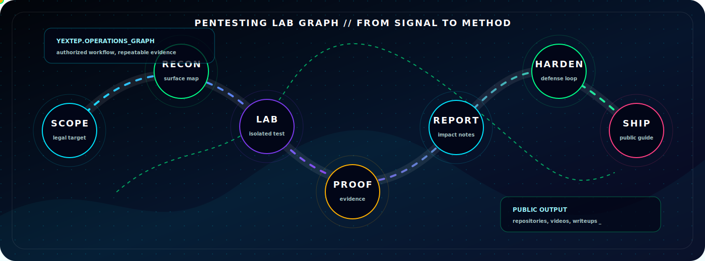
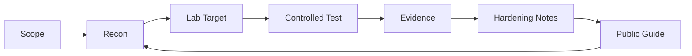
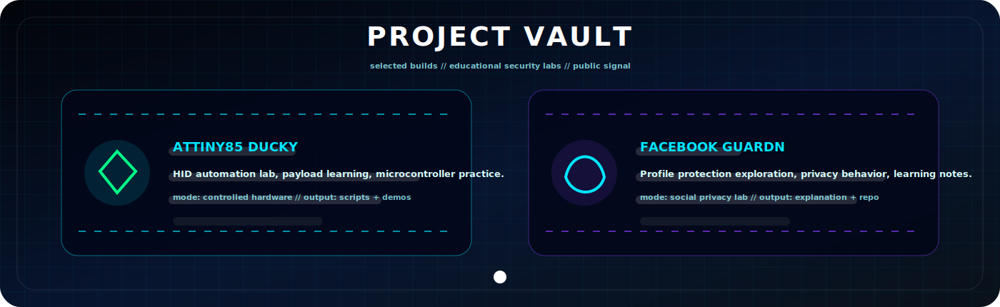
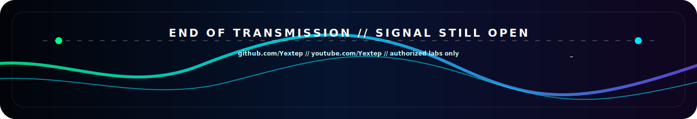

<div align="center">



<a href="https://github.com/Yextep?tab=followers">
  
</a>
<a href="https://github.com/Yextep">
  
</a>
<a href="https://www.youtube.com/Yextep">
  
</a>
<a href="https://github.com/Yextep?tab=repositories">
  
</a>

<br /><br />

<a href="#ops"></a>
<a href="#modules"></a>
<a href="#vault"></a>
<a href="#telemetry"></a>
<a href="#contact"></a>

</div>

---

<a id="ops"></a>

<div align="center">



</div>

<table>
  <tr>
    <td width="25%" align="center"><strong>RECON</strong><br />OSINT, scope, signal</td>
    <td width="25%" align="center"><strong>EXPLOIT LAB</strong><br />controlled targets</td>
    <td width="25%" align="center"><strong>PAYLOADS</strong><br />education only</td>
    <td width="25%" align="center"><strong>REPORT</strong><br />proof, fix, teach</td>
  </tr>
</table>



---

<a id="modules"></a>

<details open>
<summary><strong>OPEN // CYBER TERMINAL</strong></summary>



</details>

<details>
<summary><strong>OPEN // OPERATOR MATRIX</strong></summary>

| Module | Signal |
| --- | --- |
| Recon Engine | Enumeracion, OSINT legal, mapas de superficie |
| Payload Forge | Payloads educativos, automatizacion, HID lab |
| Hardware Bridge | Attiny85, Arduino, pruebas con dispositivos propios |
| Defensive Loop | Reporte, hardening, notas reproducibles |

</details>

<details>
<summary><strong>OPEN // RESPONSIBLE MODE</strong></summary>

```txt
scope: authorized targets only
mode: lab first, public proof second
output: tools + notes + videos
rule: no noise, no claims without evidence
```

</details>

---

<a id="vault"></a>

<div align="center">



<a href="https://github.com/Yextep/Attiny85-Ducky">
  
</a>
<a href="https://github.com/Yextep/guardn">
  
</a>

</div>

---

<a id="telemetry"></a>

<div align="center">


<br />


<br />


<br />


</div>

---

<a id="contact"></a>

<div align="center">

<a href="https://github.com/Yextep">
  
</a>
<a href="https://www.youtube.com/Yextep">
  
</a>
<a href="https://github.com/Yextep?tab=repositories">
  
</a>

<br /><br />



</div>
