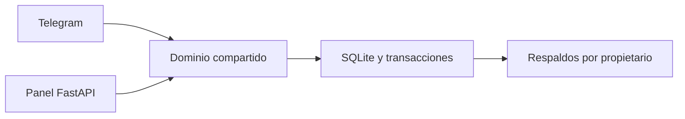
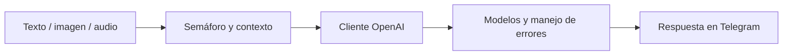
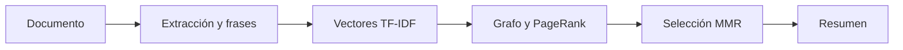
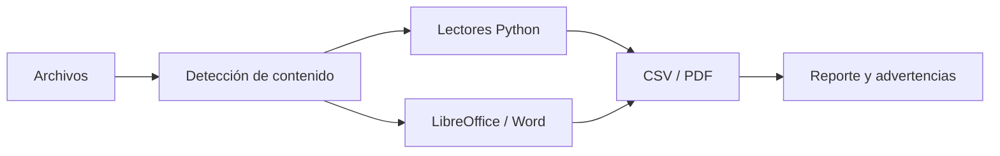
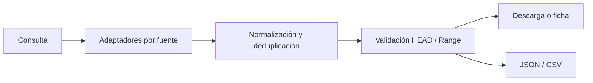
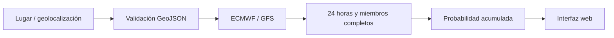

<picture>
  <source media="(prefers-reduced-motion: reduce) and (prefers-color-scheme: dark) and (max-width: 640px)" srcset="./assets/atlas-v1/hero-dark-mobile-static.svg">
  <source media="(prefers-reduced-motion: reduce) and (max-width: 640px)" srcset="./assets/atlas-v1/hero-light-mobile-static.svg">
  <source media="(prefers-reduced-motion: reduce) and (prefers-color-scheme: dark)" srcset="./assets/atlas-v1/hero-dark-static.svg">
  <source media="(prefers-reduced-motion: reduce)" srcset="./assets/atlas-v1/hero-light-static.svg">
  <source media="(prefers-color-scheme: dark) and (max-width: 640px)" srcset="./assets/atlas-v1/hero-dark-mobile.svg">
  <source media="(max-width: 640px)" srcset="./assets/atlas-v1/hero-light-mobile.svg">
  <source media="(prefers-color-scheme: dark)" srcset="./assets/atlas-v1/hero-dark.svg">
  
</picture>

**Soy Yextep.** Desarrollo herramientas para trabajar con información, automatizar tareas y llevar aplicaciones del código al uso cotidiano. Mis proyectos recorren asistentes de IA, procesamiento de documentos, aplicaciones locales y exploración de datos.

  <a href="#proyectos">Los seis proyectos</a> &nbsp; · &nbsp; <a href="#forma-de-construir">Forma de construir</a> &nbsp; · &nbsp; <a href="https://github.com/Yextep?tab=repositories">Todos los repositorios</a> &nbsp; · &nbsp; <a href="https://www.youtube.com/Yextep">YouTube</a>

## Seis proyectos para conocer mi trabajo

Ordenados de mayor a menor complejidad observada en su implementación. La selección considera arquitectura, persistencia, algoritmos, integraciones y tratamiento de errores.

<a href="https://github.com/Yextep/prestamos">
<picture>
  <source media="(prefers-color-scheme: dark) and (max-width: 640px)" srcset="./assets/atlas-v1/project-01-dark-mobile.svg">
  <source media="(max-width: 640px)" srcset="./assets/atlas-v1/project-01-light-mobile.svg">
  <source media="(prefers-color-scheme: dark)" srcset="./assets/atlas-v1/project-01-dark.svg">
  
</picture>
</a>

Cartera de préstamos en COP con bot de Telegram y panel web local. Comparte cálculos, historial y almacenamiento entre ambas interfaces.

<strong>01 · Abrir la ficha técnica</strong>

**Dónde está la complejidad.** Reglas de calendario e importes con Decimal, conversaciones persistentes, aislamiento por propietario y respaldos transaccionales.

El dominio calcula el saldo por fechas. SQLite conserva préstamos, pagos, anulaciones y conversaciones. El panel añade sesiones, protección CSRF y confirmación de importaciones.


```mermaid
flowchart LR
  T[Telegram] --> D[Dominio compartido]
  W[Panel FastAPI] --> D
  D --> S[SQLite y transacciones]
  S --> R[Respaldos por propietario]
```

**Qué se puede comprobar.** 98 casos de prueba verificados localmente; las pruebas usan datos ficticios y no envían mensajes a Telegram.

[Explorar el proyecto](https://github.com/Yextep/prestamos) · [Leer la implementación](https://github.com/Yextep/prestamos/blob/main/prestamos/storage.py)

<a href="https://github.com/Yextep/TataBot">
<picture>
  <source media="(prefers-reduced-motion: reduce) and (prefers-color-scheme: dark) and (max-width: 640px)" srcset="./assets/atlas-v1/project-02-dark-mobile-static.svg">
  <source media="(prefers-reduced-motion: reduce) and (max-width: 640px)" srcset="./assets/atlas-v1/project-02-light-mobile-static.svg">
  <source media="(prefers-reduced-motion: reduce) and (prefers-color-scheme: dark)" srcset="./assets/atlas-v1/project-02-dark-static.svg">
  <source media="(prefers-reduced-motion: reduce)" srcset="./assets/atlas-v1/project-02-light-static.svg">
  <source media="(prefers-color-scheme: dark) and (max-width: 640px)" srcset="./assets/atlas-v1/project-02-dark-mobile.svg">
  <source media="(max-width: 640px)" srcset="./assets/atlas-v1/project-02-light-mobile.svg">
  <source media="(prefers-color-scheme: dark)" srcset="./assets/atlas-v1/project-02-dark.svg">
  
</picture>
</a>

Asistente de Telegram que integra conversación, análisis de documentos e imágenes, generación y edición de imágenes, transcripción y voz.

<strong>02 · Abrir la ficha técnica</strong>

**Dónde está la complejidad.** Concurrencia limitada, memoria por chat, selección de modelos, gestión de errores y alternativas para la entrega de medios.

Los bloqueos asíncronos protegen escrituras de estado. La memoria y el contexto se guardan por chat; el cliente clasifica fallos de red, cuota y configuración. El envío adapta texto y medios a las restricciones de Telegram.


```mermaid
flowchart LR
  I[Texto / imagen / audio] --> G[Semáforo y contexto]
  G --> C[Cliente OpenAI]
  C --> F[Modelos y manejo de errores]
  F --> O[Respuesta en Telegram]
```

**Qué se puede comprobar.** La implementación separa memoria, cliente HTTP, gestión de claves y envío a Telegram en clases y funciones específicas.

[Explorar el proyecto](https://github.com/Yextep/TataBot) · [Leer la implementación](https://github.com/Yextep/TataBot/blob/main/tata_bot.py)

<a href="https://github.com/Yextep/Resu">
<picture>
  <source media="(prefers-reduced-motion: reduce) and (prefers-color-scheme: dark) and (max-width: 640px)" srcset="./assets/atlas-v1/project-03-dark-mobile-static.svg">
  <source media="(prefers-reduced-motion: reduce) and (max-width: 640px)" srcset="./assets/atlas-v1/project-03-light-mobile-static.svg">
  <source media="(prefers-reduced-motion: reduce) and (prefers-color-scheme: dark)" srcset="./assets/atlas-v1/project-03-dark-static.svg">
  <source media="(prefers-reduced-motion: reduce)" srcset="./assets/atlas-v1/project-03-light-static.svg">
  <source media="(prefers-color-scheme: dark) and (max-width: 640px)" srcset="./assets/atlas-v1/project-03-dark-mobile.svg">
  <source media="(max-width: 640px)" srcset="./assets/atlas-v1/project-03-light-mobile.svg">
  <source media="(prefers-color-scheme: dark)" srcset="./assets/atlas-v1/project-03-dark.svg">
  
</picture>
</a>

Resumidor local de documentos con extracción multiformato, OCR opcional y selección de frases mediante técnicas clásicas de procesamiento de texto.

<strong>03 · Abrir la ficha técnica</strong>

**Dónde está la complejidad.** Vectores dispersos, similitud de coseno, grafos de frases, PageRank y selección que equilibra relevancia y diversidad.

Combina señales léxicas y de estructura con TextRank. MMR reduce redundancia al seleccionar frases. Incluye modos jerárquicos, por consulta, comparativos y mapas conceptuales.


```mermaid
flowchart LR
  D[Documento] --> E[Extracción y frases]
  E --> V[Vectores TF-IDF]
  V --> G[Grafo y PageRank]
  G --> M[Selección MMR]
  M --> R[Resumen]
```

**Qué se puede comprobar.** Los algoritmos de puntuación y selección están implementados en el propio código; los resúmenes son extractivos.

[Explorar el proyecto](https://github.com/Yextep/Resu) · [Leer la implementación](https://github.com/Yextep/Resu/blob/main/resumidor_pro.py)

<a href="https://github.com/Yextep/CSV-PDF">
<picture>
  <source media="(prefers-color-scheme: dark) and (max-width: 640px)" srcset="./assets/atlas-v1/project-04-dark-mobile.svg">
  <source media="(max-width: 640px)" srcset="./assets/atlas-v1/project-04-light-mobile.svg">
  <source media="(prefers-color-scheme: dark)" srcset="./assets/atlas-v1/project-04-dark.svg">
  
</picture>
</a>

Conversor recursivo de hojas Excel/Calc a CSV y documentos Word/Writer a PDF, con motores alternativos y un reporte de cada ejecución.

<strong>04 · Abrir la ficha técnica</strong>

**Dónde está la complejidad.** Detección del contenido real, lectores de distintos formatos, automatización de motores externos y registro del método utilizado.

Contempla formatos binarios, OpenXML, HTML y XML. Las alternativas de PDF basadas en texto tienen límites de fidelidad que quedan documentados junto al resultado.


```mermaid
flowchart LR
  F[Archivos] --> D[Detección de contenido]
  D --> P[Lectores Python]
  D --> E[LibreOffice / Word]
  P --> O[CSV / PDF]
  E --> O
  O --> R[Reporte y advertencias]
```

**Qué se puede comprobar.** Cada hoja se exporta por separado; los reportes conservan rutas, métodos, advertencias y errores.

[Explorar el proyecto](https://github.com/Yextep/CSV-PDF) · [Leer la implementación](https://github.com/Yextep/CSV-PDF/blob/main/csv-pdf.py)

<a href="https://github.com/Yextep/Booky">
<picture>
  <source media="(prefers-color-scheme: dark) and (max-width: 640px)" srcset="./assets/atlas-v1/project-05-dark-mobile.svg">
  <source media="(max-width: 640px)" srcset="./assets/atlas-v1/project-05-light-mobile.svg">
  <source media="(prefers-color-scheme: dark)" srcset="./assets/atlas-v1/project-05-dark.svg">
  
</picture>
</a>

Buscador de libros y documentos abiertos con adaptadores para siete proveedores, validación de enlaces y exportación de metadatos.

<strong>05 · Abrir la ficha técnica</strong>

**Dónde está la complejidad.** Normalización de resultados heterogéneos, deduplicación, comprobaciones HTTP y distinción entre fichas y descargas disponibles.

Valida estado, tamaño y tipo de contenido. Recomprueba un enlace antes de descargar, escribe primero en un archivo temporal y guarda los metadatos del documento.


```mermaid
flowchart LR
  Q[Consulta] --> P[Adaptadores por fuente]
  P --> N[Normalización y deduplicación]
  N --> H[Validación HEAD / Range]
  H --> D[Descarga o ficha]
  H --> M[JSON / CSV]
```

**Qué se puede comprobar.** Incluye proveedores para Gutenberg, arXiv, DOAB, Europe PMC, Internet Archive, Open Library y OpenAlex.

[Explorar el proyecto](https://github.com/Yextep/Booky) · [Leer la implementación](https://github.com/Yextep/Booky/blob/main/booky_open.py)

<a href="https://github.com/Yextep/prediccion-clima">
<picture>
  <source media="(prefers-color-scheme: dark) and (max-width: 640px)" srcset="./assets/atlas-v1/project-06-dark-mobile.svg">
  <source media="(max-width: 640px)" srcset="./assets/atlas-v1/project-06-light-mobile.svg">
  <source media="(prefers-color-scheme: dark)" srcset="./assets/atlas-v1/project-06-dark.svg">
  
</picture>
</a>

Pronóstico de lluvia para Colombia con interfaz web local, búsqueda de lugares y estimaciones calculadas a partir de ensambles ECMWF y GFS.

<strong>06 · Abrir la ficha técnica</strong>

**Dónde está la complejidad.** Semántica temporal de la precipitación, validación de miembros completos, límites geográficos y caché por lugar, fecha y hora.

El porcentaje diario se calcula por miembros que alcanzan el umbral acumulado. Distingue el día completo del período restante, rechaza datos incompletos y muestra cuándo cambia de modelo.


```mermaid
flowchart LR
  L[Lugar / geolocalización] --> G[Validación GeoJSON]
  G --> E[ECMWF / GFS]
  E --> V[24 horas y miembros completos]
  V --> P[Probabilidad acumulada]
  P --> W[Interfaz web]
```

**Qué se puede comprobar.** 12 pruebas verificadas localmente cubren cálculo, medianoche, islas, caché y proveedor alternativo.

[Explorar el proyecto](https://github.com/Yextep/prediccion-clima) · [Leer la implementación](https://github.com/Yextep/prediccion-clima/blob/main/clima.py)

## Forma de construir

<picture>
  <source media="(prefers-color-scheme: dark) and (max-width: 640px)" srcset="./assets/atlas-v1/process-dark-mobile.svg">
  <source media="(max-width: 640px)" srcset="./assets/atlas-v1/process-light-mobile.svg">
  <source media="(prefers-color-scheme: dark)" srcset="./assets/atlas-v1/process-dark.svg">
  
</picture>

Me interesan las partes que hacen que una herramienta sea útil: conservar el estado, entender qué representa un dato, explicar los resultados y tener una respuesta cuando una dependencia falla.

| Área | Una decisión que se puede seguir en el código |
| --- | --- |
| Estado y consistencia | Transacciones y conversaciones guardadas en `prestamos`. |
| Integración y concurrencia | Contexto por chat, semáforos y gestión de errores en `TataBot`. |
| Algoritmos y representación | Vectores dispersos, grafos y diversidad de frases en `Resu`. |
| Compatibilidad y trazabilidad | Lectores alternativos, métodos y advertencias en `CSV-PDF`. |
| Acceso y verificación | Adaptadores por fuente y comprobaciones HTTP en `Booky`. |
| Tiempo y territorio | Intervalos de precipitación, miembros completos y GeoJSON en `prediccion-clima`. |

También hay código detrás de esta identidad visual

El nudo de la cabecera se construye a partir de una curva paramétrica en tres dimensiones. Una malla tubular se proyecta a SVG, se ordena por profundidad y se ilumina por caras. Las fichas usan diagramas vectoriales dibujados para cada proyecto.

$$C(t)=\big((2+\cos 3t)\cos 2t,\ (2+\cos 3t)\sin 2t,\ \sin 3t\big),\quad 0\leq t<2\pi$$

La superficie recorre 112 secciones de la curva y 10 vértices por sección: 1.120 caras antes de la proyección. La luz se calcula con las normales de cada cara.

Las imágenes tienen variantes claras, oscuras y móviles. Las animaciones respetan la preferencia de movimiento reducido. Los recursos visuales se sirven desde este repositorio; los diagramas desplegables se renderizan con Mermaid en GitHub.

Las comprobaciones de 98 y 12 pruebas corresponden a una ejecución local del 7 de octubre de 2026, con los archivos publicados de `prestamos` y `prediccion-clima`.

<a href="https://github.com/Yextep?tab=repositories">Explorar los repositorios</a> &nbsp; · &nbsp; <a href="https://www.youtube.com/Yextep">Ver mi canal</a>

<picture>
  <source media="(prefers-color-scheme: dark) and (max-width: 640px)" srcset="./assets/atlas-v1/footer-dark-mobile.svg">
  <source media="(max-width: 640px)" srcset="./assets/atlas-v1/footer-light-mobile.svg">
  <source media="(prefers-color-scheme: dark)" srcset="./assets/atlas-v1/footer-dark.svg">
  
</picture>
