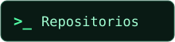
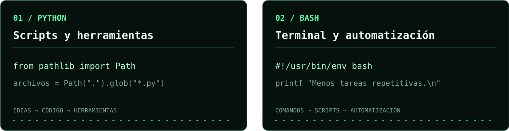
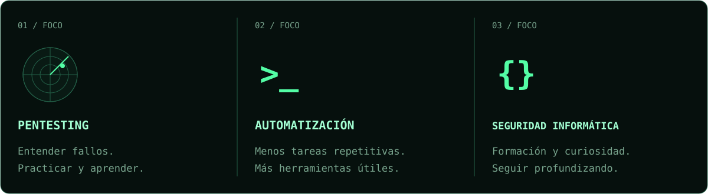
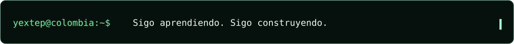

<picture>
  <source media="(prefers-reduced-motion: reduce) and (max-width: 640px)" srcset="./assets/terminal-v2/profile-mobile-static.svg">
  <source media="(prefers-reduced-motion: reduce)" srcset="./assets/terminal-v2/profile-static.svg">
  <source media="(max-width: 640px)" srcset="./assets/terminal-v2/profile-mobile.svg">
  
</picture>

**Soy Daniel Lezcano.** Estudio Seguridad Informática, programo en **Python y Bash**, me interesa el **pentesting** y el desarrollo de **herramientas automatizadas**.

  
  

**`01 / MI CAJA DE HERRAMIENTAS`**

<picture>
  <source media="(prefers-reduced-motion: reduce) and (max-width: 640px)" srcset="./assets/terminal-v2/stack-mobile-static.svg">
  <source media="(prefers-reduced-motion: reduce)" srcset="./assets/terminal-v2/stack-static.svg">
  <source media="(max-width: 640px)" srcset="./assets/terminal-v2/stack-mobile.svg">
  
</picture>

**`02 / LO QUE ME INTERESA`**

<picture>
  <source media="(prefers-reduced-motion: reduce) and (max-width: 640px)" srcset="./assets/terminal-v2/focus-mobile-static.svg">
  <source media="(prefers-reduced-motion: reduce)" srcset="./assets/terminal-v2/focus-static.svg">
  <source media="(max-width: 640px)" srcset="./assets/terminal-v2/focus-mobile.svg">
  
</picture>

**`03 / ACTIVIDAD PÚBLICA`**

<picture>
  <source media="(prefers-reduced-motion: reduce)" srcset="./assets/terminal-v2/activity-static.svg">
  
</picture>

<picture>
  <source media="(prefers-reduced-motion: reduce) and (max-width: 640px)" srcset="./assets/terminal-v2/footer-mobile-static.svg">
  <source media="(prefers-reduced-motion: reduce)" srcset="./assets/terminal-v2/footer-static.svg">
  <source media="(max-width: 640px)" srcset="./assets/terminal-v2/footer-mobile.svg">
  
</picture>
